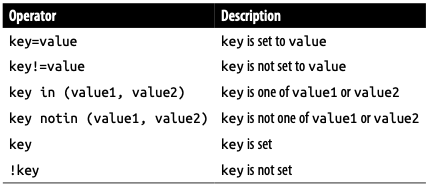

# Labels and Annotations
## Labels
### Applying Labels

***Deprecated commands***
```
kubectl run alpaca-prod --image=gcr.io/kuar-demo/kuard-amd64:blue --replicas=2 --labels="ver=1,app=alpaca,env=prod"
kubectl run alpaca-test --image=gcr.io/kuar-demo/kuard-amd64:green --replicas=1 --labels="ver=2,app=alpaca,env=test"
kubectl run bandicoot-prod --image=gcr.io/kuar-demo/kuard-amd64:green --replicas=2 --labels="ver=2,app=bandicoot,env=prod"
kubectl run bandicoot-staging --image=gcr.io/kuar-demo/kuard-amd64:green --replicas=1 --labels="ver=2,app=bandicoot,env=staging"
```
***New commands***
```
#create a Deployment
kubectl create deployment alpaca-prod --image=gcr.io/kuar-demo/kuard-amd64:blue --replicas=2
#apply labels
kubectl label deployment alpaca-prod ver=1 app=alpaca env=prod --overwrite=true

kubectl create deployment alpaca-test --image=gcr.io/kuar-demo/kuard-amd64:blue --replicas=1
kubectl label deployment alpaca-test ver=2 app=alpaca env=test --overwrite=true

kubectl create deployment bandicoot-prod --image=gcr.io/kuar-demo/kuard-amd64:green --replicas=2
kubectl label deployment bandicoot-prod ver=2 app=bandicoot env=prod --overwrite=true

kubectl create deployment bandicoot-staging --image=gcr.io/kuar-demo/kuard-amd64:green --replicas=1
kubectl label deployment bandicoot-staging ver=2 app=bandicoot env=staging --overwrite=true
```

- Check deployment labels: `kubectl get deployments --show-labels`
- Check label as a column: `kubectl get deployments -L env`
    - Check multiple labels as columns: `kubectl get deployments -L env,app`

### Modifying Labels
- Update label: `kubectl label deployments alpaca-test "canary=true"`
- Check label as a columns: `kubectl get deployments -L canary`
- Remove a label: `kubectl label deployments alpaca-test "canary-"`

### Label Selectors
Label selectors are used **to filter Kubernetes objects** based on a set of labels. Selectors use a simple syntax for **Boolean expressions**


- Check labels: `kubectl get deployments --show-labels`
- Filtering using label selectors:
    - Using single condition: `kubectl get deployments --selector="ver=2"` or `kubectl get deployments --selector=ver=2` or `kubectl get deployments -l "ver=2"` or `kubectl get deployments -l ver=2`
    - Use multiple condition (AND operation):`kubectl get deployments --selector="app=bandicoot,ver=2"`
    - Filter from a set of options:`kubectl get deployments --selector="app in (alpaca,bandicoot)"` [Like SQL]
    -  Checking if a label is set at all: `kubectl get deployments --selector="canary"`

        

## Cleanup
- Cleanup all deployments: `kubectl delete deployments --all`
- Cleanup using label selectors: `kubectl delete deployments --selector="app=bandicoot,ver=2"`