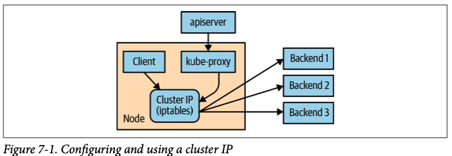

# Service Discovery
## The Service Object
- Create deployment: `kubectl create deployment alpaca-prod --image=gcr.io/kuar-demo/kuard-amd64:blue --port=8080`
- Scales the Deployment to create 3 identical replicas: `kubectl scale deployment alpaca-prod --replicas 3`
- Creates a Service to expose the Deployment internally in the cluster: `kubectl expose deployment alpaca-prod`

Create another one
```
kubectl create deployment bandicoot-prod --image=gcr.io/kuar-demo/kuard-amd64:green --port=8080
kubectl scale deployment bandicoot-prod --replicas 2
kubectl expose deployment bandicoot-prod
```

- Checkt the services: `kubectl get services -o wide`

- Port forwarding a pods to local host:
    - Getting pod name related to an alpaca app[first item]: `ALPACA_POD=$(kubectl get pods -l app=alpaca-prod -o jsonpath='{.items[0].metadata.name}')` 
    - Port-forwarding to 48858 of localhost: `kubectl port-forward $ALPACA_POD 48858:8080`
    - Check http://localhost:48858

## Service DNS
`alpaca-prod.default.svc.cluster.local.`
- **alpaca-prod**: The name of the service in question
- **default**: The namespace that this service is in.
- **svc**: Recognizing that this is a service. This allows Kubernetes to expose other types of things as DNS in the future.
- **cluster.local.**: The base domain name for the cluster. This is the default and what you will see for most clusters. Administrators may change this to allow unique DNS names across multiple clusters.

## Readiness Checks
### Modify deployment
- Edit deployment: `kubectl edit deployment/alpaca-prod`
    - This command will fetch the current version of the alpaca-prod deployment and bring it up in an editor. After you save and quit your editor, it’ll write the object back to Kubernetes
    - Updating the deployment definition will **delete and re-create** the alpaca Pods

```
spec: 
    ...
    template:
        ...
        spec:
          containers:
            ...
            name: alpaca-prod
            readinessProbe:
                httpGet:
                    path: /ready
                    port: 8080
                periodSeconds: 2
                initialDelaySeconds: 0
                failureThreshold: 3
                successThreshold: 1
```
- Re-apply port-forward command
- Check what a service is sending traffic to: `kubectl get endpoints alpaca-prod --watch`


## Looking Beyond the Cluster
- Modify the service to update **spec.type** to **NodePort**: `kubectl edit service alpaca-prod`
- Get NodePort info: `kubectl describe service alpaca-prod`
- Access the service
    - If your cluster is in **Same network**: http://localhost:8080
    - If your cluster is in the **cloud someplace**: `ssh <node-ip> -L 8080:localhost:<NodePort>`  
        Check the browser: http://localhost:8080
        

## Load Balancer Integration
### External Load Balancer
Creating a service of type LoadBalancer exposes that service to the public internet
- Modify the service to update **spec.type** to **LoadBalancer**  
**Note**: A public address (EXTERNAL-IP) is assigned by cloud in this case

### Internal Load Balancer
- You’ll often want to expose your application within only your private network. To achieve this, use an internal load balancer
- Need to update the service to add annotations for internal load balancer
```
... 
metadata:
    ... 
    name: some-service 
    annotations:
        cloud.google.com/load-balancer-type: "Internal"
...
```

## Advanced Details
### Endpoints
Some applications (and the system itself) want to be able to use services without using a cluster IP. This is done with another type of object called an Endpoints object.

- Check endpoint details: `kubectl describe endpoints alpaca-prod`
- Stream endpoint states to observe the changes: `kubectl get endpoints alpaca-prod --watch`
- Re-create the deployment:
    - Delete the current deployment: `kubectl delete deployment alpaca-prod`
    - Create new deployment: `kubectl create deployment alpaca-prod --image=gcr.io/kuar-demo/kuard-amd64:blue --port=8080`
    - Create replicas: `kubectl scale deployment alpaca-prod --replicas=3`

### Manual Service Discovery
- Kubernetes services are built on top of label selectors over Pods. That means that you can use the Kubernetes API to do rudimentary service discovery without using a Service object at all!  
- You can always use labels to identify the set of Pods you are interested in, get all of the Pods for those labels, and dig out the IP address
    - Check pods labels: `kubectl get pods -o wide --show-labels`
    - Filter pods with desired labels: `kubectl get pods -o wide --selector=app=alpaca`


### kube-proxy and Cluster IPs
Cluster IPs are stable virtual IPs that load balance traffic across all of the endpoints in a service. This magic is performed by a component running on every node in the cluster called the kube-proxy

Here,
- The kube-proxy watches for new services in the cluster via the API server. 
- It then programs a set of iptables rules in the kernel of that host to rewrite the destinations of packets so they are directed at one of the endpoints for that service. 
- If the set of endpoints for a service changes (due to Pods coming and going or due to a failed readiness check), the set of iptables rules is rewritten.


### Cluster IP Environment Variables
- While most users should be using the DNS services to find cluster IPs, there are some older mechanisms that may still be in use. One of these is **injecting a set of environment variables** into Pods as they start up
- To look at the console for the bandicoot instance of kuard:
    - Use the following command in terminal  
        - `BANDICOOT_POD=$(kubectl get pods -l app=bandicoot -o jsonpath='{.items[0].metadata.name}')`
        - `kubectl port-forward $BANDICOOT_POD 48858:8080`
    - Now point your browser to http://localhost:48858 to see the status page for this server and expand the “Server Env” section and check the set of environment variables

## Connecting with Other Environments
### Connecting to Resources Outside of a Cluster
- When you are connecting Kubernetes to legacy resources outside of the cluster, you can use selector-less services to declare a Kubernetes service with a manually assigned IP address that is outside of the cluster
- To create a selector-less service, you remove the **spec.selector** field from your resource, while leaving the metadata and the ports sections unchanged. Because your service has no selector, no endpoints are automatically added to the service.
- You must add them manually. Typically the endpoint that you will add will be a fixed IP address (e.g., the IP address of your database server) so you only need to add it once. But if the IP address that backs the service ever changes, you will need to update the corresponding endpoint resource

#### Real-World Example
- Scenario:
    - Your Kubernetes app needs to talk to an old MySQL database (10.0.0.50).
    - Instead of hardcoding 10.0.0.50 in your app, you:
        - Define a Service (Virtual Door):
            ```yaml
            # legacy-db-service.yaml
            apiVersion: v1
            kind: Service
            metadata:
              name: legacy-mysql      # Internal name
            spec:
              ports:
                - port: 3306            # Service port
                  targetPort: 3306        # External resource port
              # NO selector here! (This is key)
            ```
        - Link It to the Real Database (Endpoint):
            ```yaml
            # legacy-db-endpoint.yaml
            apiVersion: v1
            kind: Endpoints
            metadata:
              name: legacy-mysql  # Same as Service!
            subsets:
              - addresses:
                  - ip: 10.0.0.50  # External MySQL IP
                ports:
                  - port: 3306
            ```
        - Now, your app just calls:
            ```python
            db.connect("legacy-mysql")  # Instead of "10.0.0.50"
            ```
- Try it:
    - Deploy the Service and Endpoint:
        ```bash
        kubectl apply -f legacy-db-service.yaml
        kubectl apply -f legacy-db-endpoint.yaml
        ```
    - Verify:
        ```bash
        kubectl get svc legacy-mysql  # Check ClusterIP
        kubectl get endpoints legacy-mysql  # Check IP mapping
        ```
    - Test from a Pod:
        ```bash
        kubectl run test --image=alpine --rm -it -- sh
         legacy  # Should resolve to ClusterIP (but traffic goes to 10.0.0.50)
        ```

### Connecting External Resources to Services Inside a Cluster

## Cleanup